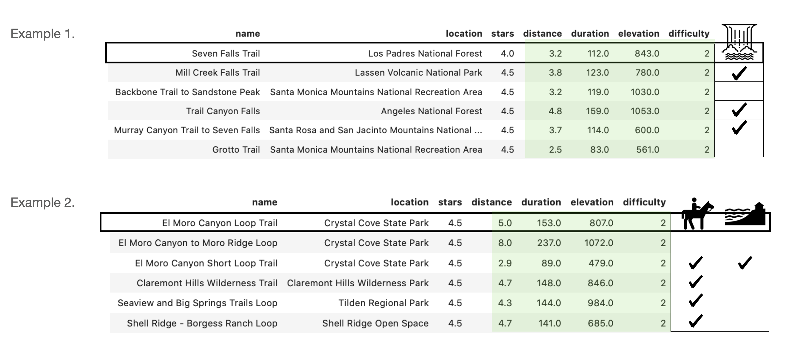

# Next Hike

## A Content based trail recommender

Hiking is a good way to exercise and spend time with friends and family, while also enjoying the surrounding nature. Hikers often rely on various trail websites to gain information about different trails and decide on which new trails to hike on. While some of these websites provide trail recommendations they are largely based on geographic location of the hike they are currently viewing. While this is a very useful feature for people hoping to find nearby trails, some user's also want to get recommendations on trails that might not be in the closet vicinity. Currently, for users who wish to find trails farther away, it is still up to the users to user search or filtering functions to look through various trails and make decision on which one to take on next. 

The goal of this project is to:
 1. Build a trail recommender that takes user’s favorite trail as an input and recommend top 5 trails that are similar to the user input
 2. Build a collaborative filtering based recommender that looks at user's previous ratings on trails and provides personalized recommendations

The recommendated trails are limited to be within the same state as user input, as trails too far away (i.e East Coast) would be less relevant and not practical. Here, we have used trails from CA for recommender, and the framework can be easily adopted and extended to other states.

## The data
### Data source
- The data was scraped from Alltrails.com using AWS, Selenium and beautiful soup
- Total of 1000 trails in CA were scraped that included 400k ratings from 200k unique users. 
- Features for each trail consisted of trail stats (i.e. distance, elevation, difficulty, star rating) as well as descriptive texts (i.e tags, short and long descriptions)

## EDA

Trail stats(i.e elevations, duration, distance) are highly right skewed distritubtion, where majority of trails have short distance/duration/elevations and few trails have long distance/duration/elevations. 

  
 
<b>Figure x.</b> Content based vs collaborative filtering based recommenders

 
From exploring the ratings data, it shows that very few users have average rating 3 or below. Majority of the users have given average rating of 4 or above. Similarly, most of the trails had average rating between 4-5 stars. From number of reviews vs trails plot, we see the typical long tail plot where there are very few items that has large number of reviews, and majority of items having very small number of reviews. However, the area under the two sections can be similar. 
 
 

  
 
<b>Figure x.</b> Content based vs collaborative filtering based recommenders

 

## Content based recommender vs collaborative filtering based recommender:
 

  
 
<b>Figure x.</b> Content based vs collaborative filtering based recommenders

 
 Content based recommender is a recommender system that is built on the item (i.e trail) information only. For example, if a user liked trail A, the recommender finds other trails that are similar to trail A based on information it has on all the trails. Then it generates a list of top n trails for the user. CB is easy to scale as it doesn't require user profiles, however, gives same recommendation regardless of user's personal taste. 
 
 Collaborative filtering based recommender is built on both user and item information. For example, if a user A liked trail A, and users B and C also liked trail A, trails that are liked by users B and C are recommended to user A. CF can give personalized recommendation based on individual user's taste, however it requires large data set with high sparsity and computation can be costly. 

### Content based recommendation
  Similarity matrix between trails were calculated. Then, based on the user input, 5 trails with highest similarity was recommended to the user. Three different content based models were established:
  1. Trail stats similarity : Features such as distance, elevation, difficulty were used to calculate similarity. Gives recommendations based on trails stats.
  2. Text based similarity: Used NLP to obtain TF-IDF matrix, which was then converted to trail-trail similarity. Gives recommendations based on description of the trails (i.e scenary, accessibility, activities, trail conditions, etc) 
  3. Hybrid similarity: Combination of stats and text based similarity. Gives recommendations based on both trail stats and description. 
  
  Below is an example output:

  
 
<b>Figure x.</b> Content based vs collaborative filtering based recommenders

The given input was 'Seven Falls Trail' located in Santa Barbara. It has distance of 3.2 miles, duration of 112 minutes, elevation of 843 fts, with difficulty level 2, and features waterfall/

Using a trail stats based model, we see that recommended trails have trail stats very similar to that of the input trail. However, none of the trails feature waterfalls, which could be why the user liked Seen Falls trail. 

Next, using a text based model, 4 out of 5 recommendations feature water fall, but the trail stats are quite spread out from the input trail stats.

Lastly, by combining the trail stat and text based models, 3 out of 5 trails features waterfall and the trail stats are closer to the input trail compared to text based model. 

### Collaboratie filtering based recommendation 
  Collaborative filtering based recommendation models were built that utilizes ratings given by users. By using the user ratings, more personnalized recommendations can be given. Two categories of collaborative filtering were explored:
  1. Item-item based collaobratie filtering: User-user based, item-item based filtering
  2. Matrix factorization: SVD, SVDpp, NMF
  
In the original dataset, only 0.2% of the user-trail pair had been rated. In order to reduce the sparsity, a small dataset was generated by removing users and trails with low number of ratings. The small dataset had 10190 ratings from 784 users and 145 trails. 
  
  
#### Evaluation metrics
  The most idealistic way to test recommender models would be to deploy the model and test the user response through A/B testing. As conducting such test is not possible, the existing data (or part of data) can be used to assess and compare performance. The next idealistic situation is having a large dataset with low sparsity. In this case, dataset can be split into train and test dataset, to test the performance of model in test set and adjust models for overfitting or underfitting. Unfortunately, this trail ratings dataset was small: after 80/20 train-test split, majority of the users in the test set would have 1 or 2 ratings left to check the performance of the model. Thus, evaluation using pre-established methods were not applicable, and a modified evaluation metric was established. One of the main limitation of below metric is the inability to check whether the model is overfitting.  
  
  

  
 
<b>Figure x.</b> Modified evaluation metric for limited datset used for comparing CF model performance 

  
  Five different models and a baseline model were compared using above precision metric. A baseline model is where 5 recommendations were given at random and its precision was 0.09. Precision for matrix factorization models were 1.5, 1.6, and 2.4 times the baseline precision for NMF, SVD, and SVDpp models respectively. For similarity based methods,  trail-trail similarity was 1.8 and user-user similarity was 6.9 times the baseline precision. With the assumption that the models are not overfitted, the lower precision for matrix factorization models could indicate that the data is not easily separatable using the decision planes from these models. On the otherhand, KNN basedmodel can give more highly convoluted decision boundary that beter fits the data.
  
    

  
 
<b>Figure x.</b> Normalized precision for random and CF filtering methods used

  
### Web deployment:

## Future directions:
In order to improve the prediction accuracy, we could:  
- Use the incorrectly predicted images to further train our model  
- Add more images (through web scraping or data augmentation)  
- Increase the model complexity to better capture the non-linear decision boundary

Additionally, I'd like to:
- Use transfer learning and compare prediction accuracy
- Add additional cuisines and test performance

