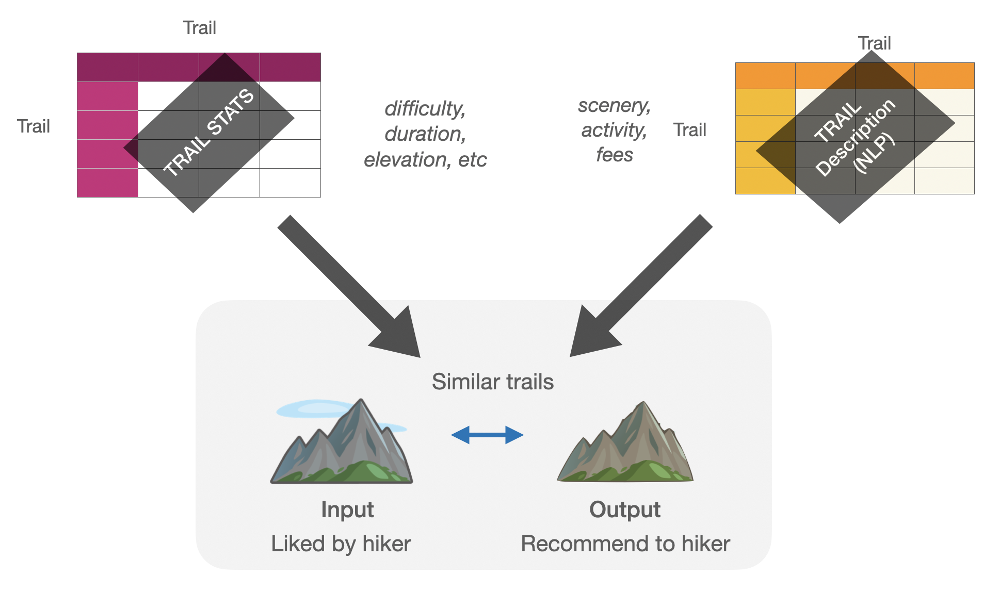

# Next Hike

## A Content based trail recommender

Hiking is a good way to exercise and spend time with friends and family, while also enjoying the surrounding nature. Hikers often rely on various trail websites to gain information about different trails and decide on which new trails to hike on. While some of these websites provide trail recommendations they are largely based on geographic location of the hike they are currently viewing. While this is a very useful feature for people hoping to find nearby trails, some user's also want to get recommendations on trails that might not be in the closet vicinity. Currently, for users who wish to find trails farther away, it is still up to the users to user search or filtering functions to look through various trails and make decision on which one to take on next. 

The goal of this project is to:
 1. Build a trail recommender that takes user’s favorite trail as an input and recommend top 5 trails that are similar to the user input
 2. Build a collaborative filtering based recommender that looks at user's previous ratings on trails and provides personalized recommendations

The recommendated trails are limited to be within the same state as user input, as trails too far away (i.e East Coast) would be less relevant and not practical. Here, we have used trails from CA for recommender, and the framework can be easily adopted and extended to other states.

## The data
### Data source
- The data was scraped from Alltrails.com using AWS, Selenium and beautiful soup
- Total of 1000 trails in CA were scraped that included 400k ratings from 200k unique users. 
- Features for each trail consisted of trail stats (i.e. distance, elevation, difficulty, star rating) as well as descriptive texts (i.e tags, short and long descriptions)

## EDA

Trail stats(i.e elevations, duration, distance) are highly right skewed distritubtion, where majority of trails have short distance/duration/elevations and few trails have long distance/duration/elevations. 

  
 
<b>Figure 1.</b> Content based vs collaborative filtering based recommenders

 
From exploring the ratings data, it shows that very few users have average rating 3 or below. Majority of the users have given average rating of 4 or above. Similarly, most of the trails had average rating between 4-5 stars. From number of reviews vs trails plot, we see the typical long tail plot where there are very few items that has large number of reviews, and majority of items having very small number of reviews. However, the area under the two sections can be similar. 
 
 

  
 
<b>Figure 2.</b> Content based vs collaborative filtering based recommenders

 

## Content based recommender vs collaborative filtering based recommender:
 

  
 
<b>Figure 3.</b> Content based vs collaborative filtering based recommenders

 
 Content based recommender is a recommender system that is built on the item (i.e trail) information only. For example, if a user liked trail A, the recommender finds other trails that are similar to trail A based on information it has on all the trails. Then it generates a list of top n trails for the user. CB is easy to scale as it doesn't require user profiles, however, gives same recommendation regardless of user's personal taste. 
 
 Collaborative filtering based recommender is built on both user and item information. For example, if a user A liked trail A, and users B and C also liked trail A, trails that are liked by users B and C are recommended to user A. CF can give personalized recommendation based on individual user's taste, however it requires large data set with high sparsity and computation can be costly. 

##
### Content based recommendation
  Similarity matrix between trails were calculated. Then, based on the user input, 5 trails with highest similarity was recommended to the user. Similarity function was calculated using both trail stats as well as NLP based text descriptions:
  
  

  
 
<b>Figure x.</b> Content based recommender similarity matrix from trail stats and text descriptions

  
  Below is an example output:

  
 
<b>Figure 4.</b> Content based vs collaborative filtering based recommenders

The first example input is 'Seven Falls Trail' located in Santa Barbara that features water fall and the second example is 'El Moro" trail that features horseback riding and coastal view. Recommendations for both examples include trails with similar features as the input with trail stats that are similar to the input trail stats. 

##
### Collaboratie filtering based recommendation 
  Collaborative filtering based recommendation models were built that utilizes ratings given by users. By using the user ratings, more personnalized recommendations can be given. Two categories of collaborative filtering were explored:
  1. Item-item based collaobratie filtering: User-user based, item-item based filtering
  2. Matrix factorization: SVD, SVDpp, NMF
  
##  
#### Evaluation of collaborative filtering based recommendation
  Mean average precision at k=5 was used for model evaluation. Five different models and a baseline model were compared. A baseline model is where 5 recommendations were given at random and its precision was 0.09. Precision for matrix factorization models were 1.5, 1.6, and 2.4 times the baseline precision for NMF, SVD, and SVDpp models respectively. For similarity based methods,  trail-trail similarity was 1.8 and user-user similarity was 6.9 times the baseline precision. The lower precision for matrix factorization models indicates that the data is not easily separatable using the decision planes from these models. On the otherhand, KNN basedmodel can give more highly convoluted decision boundary that beter fits the data.
  

  
 
<b>Figure 5.</b> Normalized precision for random and CF filtering methods used

## Future directions:
 - Increase data quantity and improve sparsity by scraping more user ratings in order to improve model quality and performance evaluation metric
 - Add trails from other states to the database and model, and add filtering function such that user can decide which state they want recommendations from.

### Web deployment:
 Both the content based and collaborative filtering based recommenders are deployed on the web using Flask and Heroku here: 
 Feel free to give it a try!   http://nexthike.herokuapp.com

  
 
<b>Figure 6.</b> Next Hike Web App 

